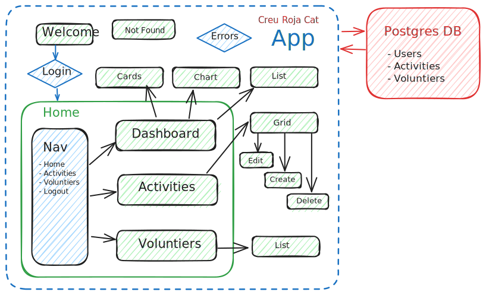

<h1>Next.js Managing system of activities for the Creu Roja center in Nou Barris, Barcelona</h1>

<a href="https://invoices-dashboard-liart.vercel.app" target="_blank">Vercel deploy here. (Please use responsibly)</a>

What to do":

- This demo emulate the Admin credentials, so you can edit crete and assign activities
to different voluntiers.

- A voluntier is suppoused login with their own credentials but just see activities and mark as "taken" or "pending" their own

What we have here:

<ul>
<li>Next.js 14 (React, Typescript)</li>
<li>Login management with Next-Auth</li>
<li>Vercel/Postgres DDBB</li>
<li>Zod validation and errors handle</li>
<li>CSS with Tailwindcss</li>
<li>Use debounce for searching optimization</li>
</ul>

//--------------------------------------------------------////

<h5>Flowchart</h5>

